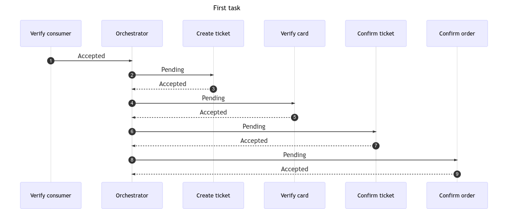

## About it ##
<b>Saga</b> is a codegenerator for a saga orchestrator pattern. This use an yaml format for a config. Look at the example in example/config.

### Config ###
A config describe a finite state machine of your transaction.
The config musts contain a milestone which contains states of the transaction.
Any state musts contain state statement.
which of that may be one of three types:
1. Compensatable 
2. Pivot
3. Retriable

Compesatable and Pivot step must contain three states – pending, approval and rejected.
Retriable step contains two states – pending and approval. 

### Code-generation ###
See makefile.
it have two parameters intput and output.


### Example ###
1. Use make gen for regenerate example code.
2. Use make example-build for rebuild example applications.
3. Use  make example-run TASK=1.
Every message in loop also goes to orchestrator then come back.  

```mermaid
sequenceDiagram
  autonumber
  Title: First task
  Verify consumer ->> Orchestrator:Accepted
  Orchestrator ->> Create ticket:Pending
  Create ticket -->> Orchestrator:Accepted
  Orchestrator ->> Verify card:Pending
  Verify card -->> Orchestrator:Accepted
  Orchestrator ->> Confirm ticket:Pending
  Confirm ticket -->> Orchestrator:Accepted
  Orchestrator ->> Confirm order:Pending
  Confirm order -->> Orchestrator:Accepted
```


```mermaid
sequenceDiagram
  autonumber
  Title: Second task
  Verify consumer ->> Orchestrator:Accepted
  Orchestrator ->> Create ticket:Pending
  Create ticket -->> Orchestrator:Rejected
  Orchestrator ->> Verify consumer:Rejected
  Verify consumer -->> Orchestrator:Accepted
```

```mermaid
sequenceDiagram
  autonumber
  Title: Third task
  Verify consumer ->> Orchestrator:Accepted
  Orchestrator ->> Create ticket:Pending
  Create ticket -->> Orchestrator:Accepted
  Orchestrator ->> Verify card:Pending
  Verify card -->> Orchestrator:Accepted
  Orchestrator ->> Confirm ticket:Pending
  loop Retry x3
  Confirm ticket ->> Confirm ticket:Rejected
  end
  Confirm ticket -->> Orchestrator:Accepted
  Orchestrator ->> Confirm order:Pending
  Confirm order -->> Orchestrator:Accepted
```

##### What's happened when service rejected tx which was rejected? #####

##### What's happened when retriable tx is rejected? #####